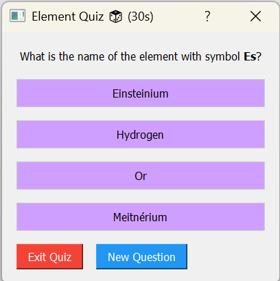

# 🧪 InteractivePT: Periodic Table for S&P Package

> 📢 **Note to users:** This tool was specifically designed to support students in the third-semester Chemistry course at EPFL, focusing on s and p-block elements. While tailored to the subject, it can still be a useful learning resource for anyone studying general inorganic chemistry.

---


## 🎓 Project background

### The problem

In the third semester of the Chemistry bachelor at EPFL, students are required to take a course on the chemistry of s and p block elements of the periodic table. Existing resources are limited and fragmented. 

### Our solution

We created an interactive periodic table to help learn details more effectively, group useful information, and practice with either free response or multiple choice quizzes. 

---

## 📄 Description

The package generates a structured periodic table and includes utilities for working with element data. It emphasizes interactive learning and modular design for future extensions.


## 📂 Project structure 

```text
images/                          # Images for README
notebooks/                       # Project report in Jupyter notebook format
periodictable/
├── README.md                     # Project introduction, installation instructions
├── scientific_structures/        # Outer atomic orbital structures
├── src/
│   └── periodictable/
│       ├── __init__.py
│       ├── generate_structure.py # Generates atomic orbital structures for elements
│       ├── utils.py              # Functions for generating the periodic table interface
│       ├── elements_data.py      # Contains element information: basics, positions in the table, production methods
│       └── tests/
│           ├── __init__.py
│           └── test_periodictable.py # Tests for the package
```

## ✨ Features

### 🔍 Interactive Periodic Table
- **Visual Element Navigation**: Colour-coded periodic table organised by element families
- **Detailed Element Information**: Access data for each element by clicking on its tile
- **Compact Design**: Optimised layout that fits on standard screens while maintaining readability

### 📊 Element data visualisation
- **Atomic Structure Images**: Visual representation of electron configuration for each element
- **Comprehensive Element Properties**:
  - Element name and symbol
  - Atomic number and weight
  - Element family classification
  - Physical state at standard conditions
  - Electron configuration
  - Isotope information
  - Production methods with detailed reactions

### 🎮 Interactive Quiz System
- **Multiple Quiz Formats**: Choose between multiple-choice or free-response questions
- **Diverse Question Types**:
  - Identify elements by symbol
  - Identify elements by atomic number
  - Match electron configurations to elements
  - Connect production methods to elements
- **Timed Challenges**: 30-second countdown per question to test rapid recall
- **Progress Tracking**: Score monitoring throughout the quiz session
- **Session Management**: 10-question sessions with final score summary

## 📸 Visual Preview

### Periodic table introduction

<p><em>The complete interactive periodic table with color-coded element families.</em></p>

### Main periodic table view

<p><em>The complete interactive periodic table with color-coded element families.</em></p>

### Element detail view

<p><em>Detailed view of carbon showing electron configuration, properties, and production methods.</em></p>

### Quiz mode
<div>
  
  
</div>
<p><em>Challenge your knowledge with multiple choice or free response questions about elements.</em></p>

---

## 🚀 Getting started

### Prerequisites

- Python 3.10+
- Conda or virtual environment (optional but recommended)
- PyQt5
- pandas
- numpy
- scipy
- pytest

### Installation

```bash
# Clone the repository
git clone https://github.com/gleizernicole/projetch200.git

# Navigate to project directory
cd projetch200

# Create and activate virtual environment
conda create -n projetch200 python=3.10
conda activate projetch200
```

### Running the application 

```bash
# Navigate to source directory
cd src

# Generate atom structure
python -m periodictable.generate_structure

# Launch interactive periodic table
python -m periodictable.utils

```

## ✅ Testing

```bash
# Run unit tests
cd projetch200
pytest periodictable/src/periodictable/tests/test_periodictable.py -v
```
## ✉️ Contact

For questions or contributions please contact any of the following addresses: nikol.gleizer@epfl.ch, melodie.serreau@epfl.ch, siolene.croome@epfl.ch, quentin.wininger@epfl.ch. 
